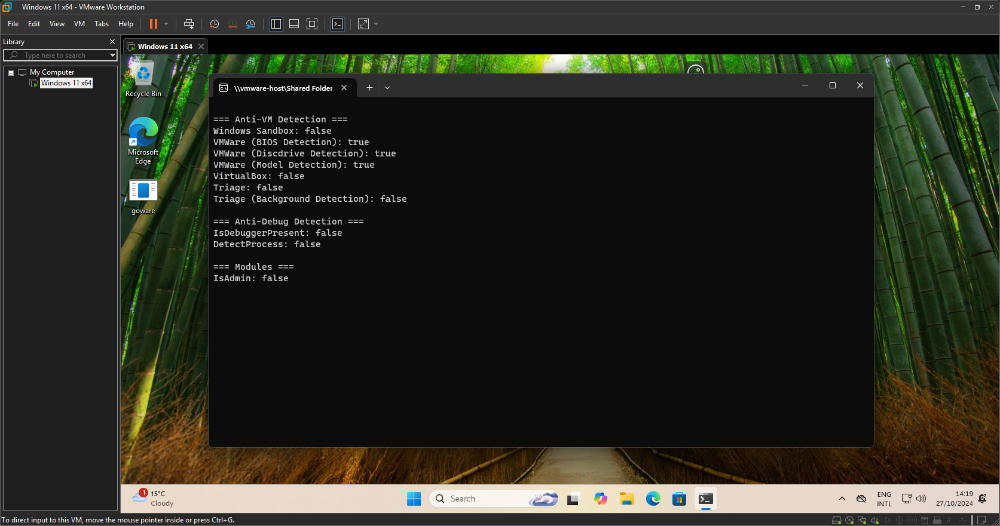

<p align="center"></p><br/>
<p align="center">Various detection mechanisms for anti-debugging and anti-virtual machine (VM) environments.</p>
<p align="center">made in golang.</p>

</p><br/><br/>

# Anti VM
## Triage
| Platform                      | Background Detection | Serials Detection | Date/time  | Screenshot                       |
|-------------------------------|----------------------|-------------------|------------|----------------------------------|
| Windows 10 (2004) x64         | **Triggered**        | **Triggered**     | 26/10/2024 |         |
| Windows 10 (LTSC 2021) x64    | **Triggered**        | **Triggered**     | 26/10/2024 |         |
| Windows 11 (21H2) x64         | **Triggered**        | **Triggered**     | 26/10/2024 |           |
## VMWare
| Platform              | Diskdrive Detection | BIOS Detection | Model Detection | Date/time  | Screenshot              |
|-----------------------|---------------------|----------------|-----------------|------------|-------------------------|
| Windows 11 (24H2) x64 | **Triggered**       | **Triggered**  | **Triggered**   | 27/10/2024 |  |
| Windows 10 (22H2) x64 | **Triggered**       | **Triggered**  | **Triggered**   | 27/10/2024 |  |
## Windows SandBox
| Platform              | Username Detection | Date/time    | Screenshot              |
|-----------------------|--------------------|--------------|-------------------------|
| Windows 11 (24H2) x64 | **Triggered**      | 27/10/2024   |  |
## VirtualBox
| Platform              | Motherboard Detection | Discdrive Detection | BIOS Detection | Date/time    | Screenshot              |
|-----------------------|-----------------------|---------------------|----------------|--------------|-------------------------|
| Windows 11 (24H2) x64 | **Triggered**         | **Triggered**       | **Triggered**  | 27/10/2024   |  |

## Installation

1. Clone the repository:
    ```sh
    git clone https://github.com/9dl/goware.git
    ```
2. Navigate to the project directory:
    ```sh
    cd goware
    ```
3. Build the project:
    ```sh
    go build
    ```

## Usage

Run the compiled binary:
```sh
./goware
